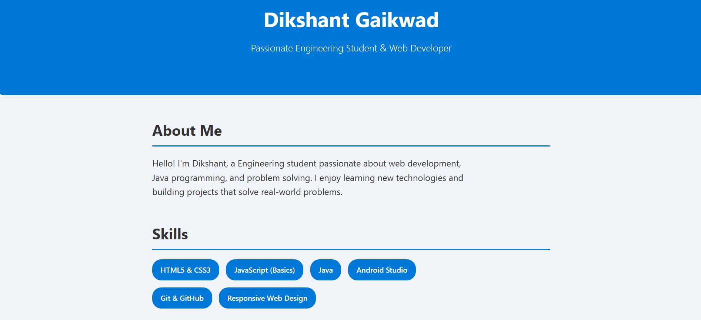
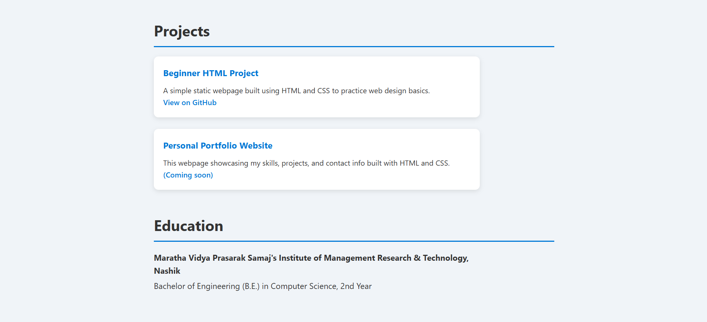
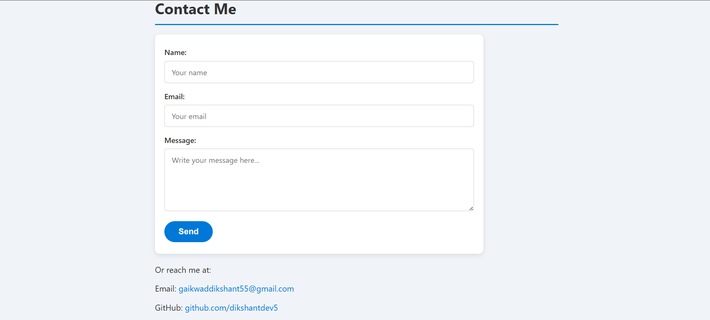

# Personal Portfolio Website

This is my personal portfolio website built using HTML and CSS.  
It showcases my skills, projects, education, and contact information in a clean and responsive design.

## Features

- About Me section  
- Skills and Projects showcase  
- Contact form (static)  
- Responsive layout for different devices

## How to Use

Open the `index.html` file in any web browser to view the portfolio.

## Technologies Used

- HTML  
- CSS  

## Screenshots

  
  
  

## Contact

Created by Dikshant Gaikwad.  
GitHub: [https://github.com/dikshantdev5](https://github.com/dikshantdev5)  
LinkedIn: [https://www.linkedin.com/in/dikshant-gaikwad-1375a130a/](https://www.linkedin.com/in/dikshant-gaikwad-1375a130a/)
